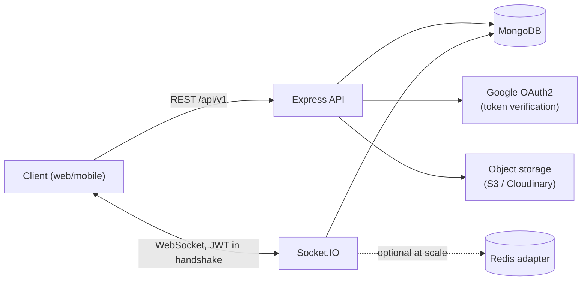

# Vybe Backend — Architecture & Design

Backend design for a social app: auth (incl. Google), profiles, posts (create/edit/like), follow graph, user search, and real-time chat restricted to followed users.

Stack decisions locked in with the user: **MongoDB + Mongoose**, **plain JavaScript (CommonJS)**, project lives in `vybe_backend/`.

## 1. Tech stack

| Concern | Choice | Why |
|---|---|---|
| Runtime | Node.js 22/24 (Active LTS) | Current LTS line; Node 24 supported until 2028. |
| Framework | Express 5.x | 5.1+ is now the default/stable line on npm as of 2025. |
| Database | MongoDB + Mongoose | Chosen by user; document model fits posts/messages well. |
| Real-time | Socket.IO v4 | De-facto standard; official JWT-in-handshake pattern (see §5). |
| Auth | JWT (access+refresh) + Google ID token verification | Stateless REST auth, same access token reused for Socket.IO handshake. |
| Password hashing | `argon2` (argon2id) | OWASP's current #1 recommendation over bcrypt (memory-hard, GPU-resistant). |
| Validation | `zod` | Schema validation for body/query/params and Socket.IO payloads alike. |
| Security middleware | `helmet`, `express-rate-limit`, `express-mongo-sanitize`, `hpp`, `cors` | Standard Express production security checklist (official Express security guide). |
| File storage | Cloudinary or S3 (not local disk) | Profile pictures / post images; local disk doesn't survive redeploys or scale horizontally. |
| Logging | `pino` + `pino-http` | Structured, fast, redacts secrets. |
| Testing | `jest`, `supertest`, `mongodb-memory-server` | Integration tests against a real in-memory Mongo instance. |

Sources consulted: [Socket.IO — how to use with JWT](https://socket.io/how-to/use-with-jwt), [Socket.IO Redis adapter](https://socket.io/docs/v4/redis-adapter/), [Express.js — Production security best practices](https://expressjs.com/en/advanced/best-practice-security.html), [Google — Verify the Google ID token server-side](https://developers.google.com/identity/gsi/web/guides/verify-google-id-token), [MongoDB — modeling followers/following as a separate collection](https://www.mongodb.com/community/forums/t/data-modeling-for-social-media-followers-following-bucket-pattern/3563), OWASP Password Storage Cheat Sheet (Argon2id recommendation), OWASP guidance on refresh token rotation.

## 2. High-level architecture



Single Node process for MVP (API + Socket.IO share the same HTTP server). Redis only becomes necessary once you run more than one instance (see §9).

## 3. Folder structure

Feature/module-based rather than layered by technical type across the whole app — keeps auth, posts, follows, and chat independently readable as the app grows.

```
vybe_backend/
├── src/
│   ├── config/
│   │   ├── env.js            # loads + validates process.env with zod, fails fast on boot
│   │   ├── db.js              # mongoose connection
│   │   └── logger.js          # pino instance
│   ├── modules/
│   │   ├── auth/
│   │   │   ├── auth.routes.js
│   │   │   ├── auth.controller.js
│   │   │   ├── auth.service.js       # register/login/google/refresh/logout logic
│   │   │   ├── auth.validation.js    # zod schemas
│   │   │   └── refreshToken.model.js
│   │   ├── users/
│   │   │   ├── user.model.js
│   │   │   ├── user.routes.js
│   │   │   ├── user.controller.js
│   │   │   └── user.service.js
│   │   ├── follows/
│   │   │   ├── follow.model.js
│   │   │   ├── follow.routes.js
│   │   │   ├── follow.controller.js
│   │   │   └── follow.service.js
│   │   ├── posts/
│   │   │   ├── post.model.js
│   │   │   ├── like.model.js
│   │   │   ├── post.routes.js
│   │   │   ├── post.controller.js
│   │   │   └── post.service.js
│   │   └── chat/
│   │       ├── conversation.model.js
│   │       ├── message.model.js
│   │       ├── chat.routes.js        # REST: conversation list + history
│   │       ├── chat.controller.js
│   │       ├── chat.service.js
│   │       └── chat.socket.js        # socket.io event handlers
│   ├── middlewares/
│   │   ├── auth.middleware.js        # verifies access JWT for REST routes
│   │   ├── error.middleware.js       # centralized error handler
│   │   ├── validate.middleware.js    # wraps zod schemas
│   │   └── rateLimit.middleware.js
│   ├── sockets/
│   │   └── index.js                  # io init, JWT auth middleware, registers chat.socket.js
│   ├── utils/
│   │   ├── ApiError.js
│   │   ├── asyncHandler.js
│   │   └── pagination.js             # cursor helpers
│   ├── app.js                        # express app assembly (no listen())
│   └── server.js                     # creates http server, attaches io, listens
├── tests/
├── .env.example
├── .gitignore
└── package.json
```

## 4. Data models

### User
```js
{
  name: String,
  username: String,        // unique, used for @handles and search
  email: String,           // unique
  passwordHash: String,     // null for Google-only accounts
  authProvider: 'local' | 'google',
  googleId: String,        // sparse unique
  bio: String,
  avatarUrl: String,
  followersCount: Number,   // denormalized, kept in sync via §6
  followingCount: Number,
  postsCount: Number,
  createdAt, updatedAt
}
```
Indexes: unique `email`; unique sparse `username`; unique sparse `googleId`; text index on `name` + `username` for search.

### Follow
```js
{ follower: ObjectId(User), following: ObjectId(User), createdAt }
```
A **separate collection**, not an array embedded in `User` — MongoDB's own guidance (and the Socialite reference architecture) recommends this for social graphs because embedded follower/following arrays grow unbounded and become expensive to update/index at scale. Compound **unique** index on `(follower, following)` prevents duplicate follows; single-field indexes on each side support "list my followers" / "list who I follow" in either direction.

### Post
```js
{ author: ObjectId(User), text: String, imageUrl: String, likesCount: Number, createdAt, updatedAt, editedAt }
```
Index on `(author, createdAt)` for profile timelines.

### Like
```js
{ post: ObjectId(Post), user: ObjectId(User), createdAt }
```
Compound unique index `(post, user)` — prevents double-likes and makes like/unlike an idempotent insert/delete.

### Conversation
```js
{ participants: [ObjectId(User), ObjectId(User)], lastMessage: { text, sender, createdAt }, createdAt, updatedAt }
```
Store `participants` sorted (e.g. `[minId, maxId]`) so the pair has one canonical document; unique index on `participants`.

### Message
```js
{ conversation: ObjectId(Conversation), sender: ObjectId(User), recipient: ObjectId(User), text: String, status: 'sent'|'delivered'|'read', createdAt }
```
Index on `(conversation, createdAt)` for paginated history.

### RefreshToken
```js
{ user: ObjectId(User), tokenHash: String, expiresAt: Date, revokedAt: Date, replacedByToken: String }
```
TTL index on `expiresAt` for automatic cleanup. Store a **hash** of the refresh token, never the raw value (same principle as password storage) so a DB leak doesn't hand out usable tokens.

## 5. Auth design

- **Register/Login (local)**: `argon2id` password hashing. On success, issue a short-lived **access token** (JWT, 15 min, returned in response body) and a **refresh token** (7–30 days, random string, hashed and stored in `RefreshToken`, set as an `httpOnly` + `secure` + `sameSite=strict` cookie).
- **Google login**: client sends the Google ID token; server verifies it with `google-auth-library`'s `OAuth2Client.verifyIdToken({ idToken, audience: GOOGLE_CLIENT_ID })`, reads `sub`/`email`/`name`/`picture` from the verified payload, upserts the user, then issues the same access/refresh pair as local login. Server never trusts a client-asserted email/profile — only the verified payload.
- **Refresh**: `/auth/refresh` reads the httpOnly cookie, checks the stored hash + expiry + not-revoked, issues a new access token **and rotates** the refresh token (old one marked revoked, points to the new one via `replacedByToken`) — refresh token rotation is the current OWASP-recommended mitigation against replay of a stolen refresh token.
- **Logout**: revokes the current refresh token, clears the cookie.
- **REST middleware**: `Authorization: Bearer <accessToken>` verified on every protected route.
- **Socket.IO handshake**: the same access token is passed as `io(url, { auth: { token } })` and verified in a connection middleware (§ below) — no separate socket auth scheme.

## 6. Follow / Like consistency

Both follow and like are "toggle" relations backed by a unique compound index, with a denormalized counter on the parent doc for fast reads (avoids `COUNT` queries on every profile view or post render):

1. Follow: insert into `Follow` (ignore duplicate-key error if already following) → `$inc` `followingCount` on follower, `followersCount` on followee. Unfollow: delete the `Follow` doc → `$inc -1` on both counters. Wrap each pair in a Mongo session/transaction (MongoDB transactions require a replica set, which Atlas gives you by default) so the counters can't drift from the relationship rows.
2. Like: same pattern with the `Like` collection and `Post.likesCount`.

## 7. REST API (versioned, `/api/v1`)

| Method & path | Purpose |
|---|---|
| `POST /auth/register` | `{name, username, email, password}` |
| `POST /auth/login` | `{email, password}` |
| `POST /auth/google` | `{idToken}` |
| `POST /auth/refresh` | reads refresh cookie, rotates it |
| `POST /auth/logout` | revokes refresh token |
| `GET /users/me` | current profile |
| `PATCH /users/me` | edit `name`, `bio`, `avatar` |
| `GET /users/:username` | public profile |
| `GET /users/search?q=` | search by name/username |
| `POST /users/:id/follow` / `DELETE /users/:id/follow` | follow / unfollow |
| `GET /users/:id/followers?cursor=&limit=` | followers list |
| `GET /users/:id/following?cursor=&limit=` | following list |
| `POST /posts` | create `{text, image}` |
| `PATCH /posts/:id` | edit (author only) |
| `DELETE /posts/:id` | delete (author only) |
| `GET /posts/feed?cursor=&limit=` | posts from followed users |
| `GET /posts/user/:username?cursor=` | a user's posts |
| `POST /posts/:id/like` / `DELETE /posts/:id/like` | like / unlike |
| `GET /chats` | conversation list with last-message preview |
| `GET /chats/:conversationId/messages?cursor=&limit=` | message history |

All list endpoints use **cursor-based pagination** (`_id`/`createdAt`), not `skip/limit` offsets — offset pagination degrades and gets inconsistent under concurrent writes at any real scale.

## 8. Real-time chat (Socket.IO)

**Connection & auth** (mirrors the [official Socket.IO JWT pattern](https://socket.io/how-to/use-with-jwt)):
```js
io.use((socket, next) => {
  try {
    const { token } = socket.handshake.auth;
    const decoded = jwt.verify(token, env.JWT_ACCESS_SECRET);
    socket.data.userId = decoded.sub;
    next();
  } catch {
    next(new Error('unauthorized'));
  }
});

io.on('connection', (socket) => {
  socket.join(socket.data.userId); // personal room — reachable regardless of tab/device/socket id
  registerChatHandlers(io, socket);
});
```

**Events:**

| Event | Direction | Payload | Server-side rule |
|---|---|---|---|
| `message:send` | client → server | `{ toUserId, text }` | Reject unless a `Follow` doc exists with `follower = self, following = toUserId` (see decision below). Persist `Message`, upsert `Conversation.lastMessage`. |
| `message:new` | server → client | full message doc | Emitted to `room(toUserId)` **and** `room(selfId)` so the sender's other sessions also see it. |
| `message:read` | client → server | `{ conversationId }` | Marks messages read; emits `message:read:ack` to the other participant. |
| `typing:start` / `typing:stop` | client → server | `{ toUserId }` | Relayed to `room(toUserId)` only, not persisted. |

The follow check happens **on the server for every `message:send`**, never trusted from the client — the same rule is enforced again on `GET /chats/:id/messages` so history can't be read for a conversation you were never allowed to start.

**Decision to confirm with product**: the requirement says "user can chat with a user whom they follow." The design above enforces it **one-directionally** (you must follow them to message them — they don't need to follow you back). If mutual-follow should be required instead, that's a one-line change to the `Follow` lookup (check both directions). Also flagging: once a conversation exists, should unfollowing lock the chat? Default here is **no** — existing conversations stay readable/writable; only *starting a new* conversation with someone you don't follow is blocked. Both are easy to change once you confirm the intended product behavior.

## 9. Security checklist

- `helmet()` + `app.disable('x-powered-by')`
- `cors({ origin: <allowlisted frontend origin(s)>, credentials: true })` — `credentials: true` is required for the refresh-token cookie
- `express-rate-limit`: tight limits on `/auth/*` (brute-force protection), looser general API limit
- `express-mongo-sanitize` + `hpp` — block NoSQL operator injection (`$gt`, etc.) and parameter pollution
- `zod` validation on every route's body/query/params, and on every socket event payload
- Centralized error handler — never leak stack traces when `NODE_ENV=production`
- Secrets only via env vars, validated at boot (fail fast if missing) — never committed
- `pino` redacts `password`, `authorization`, token fields from logs
- File uploads: `multer` with mime-type whitelist + size limit, uploaded straight to object storage (S3/Cloudinary), never written to local disk in production
- `npm audit` (or Snyk) in CI

## 10. Scaling notes (not needed for MVP, single instance is fine)

- Add `@socket.io/redis-adapter` + sticky sessions once running more than one Node process behind a load balancer, so a message can reach a recipient connected to a *different* instance.
- Move refresh-token/rate-limit state to Redis once horizontally scaled (in-memory stores stop being consistent across instances).
- Feed is "fan-out on read" (query posts where `author in [followingIds]`) for the MVP — simplest correct approach. If a user's following-count and post volume gets large enough for this query to get slow, migrate to "fan-out on write" (a precomputed per-user feed collection) as a later optimization, not an upfront one.

## 11. Suggested dependencies

```
dependencies: express, mongoose, socket.io, jsonwebtoken, argon2, google-auth-library,
              cors, helmet, express-rate-limit, express-mongo-sanitize, hpp,
              cookie-parser, zod, dotenv, multer, cloudinary, pino, pino-http, compression
devDependencies: nodemon, jest, supertest, mongodb-memory-server, eslint, prettier
```

## 12. Environment variables

```
NODE_ENV, PORT, MONGO_URI, CLIENT_ORIGIN,
JWT_ACCESS_SECRET, JWT_ACCESS_EXPIRES, JWT_REFRESH_SECRET, JWT_REFRESH_EXPIRES,
GOOGLE_CLIENT_ID,
CLOUDINARY_URL (or AWS_ACCESS_KEY_ID / AWS_SECRET_ACCESS_KEY / AWS_REGION / S3_BUCKET)
```
